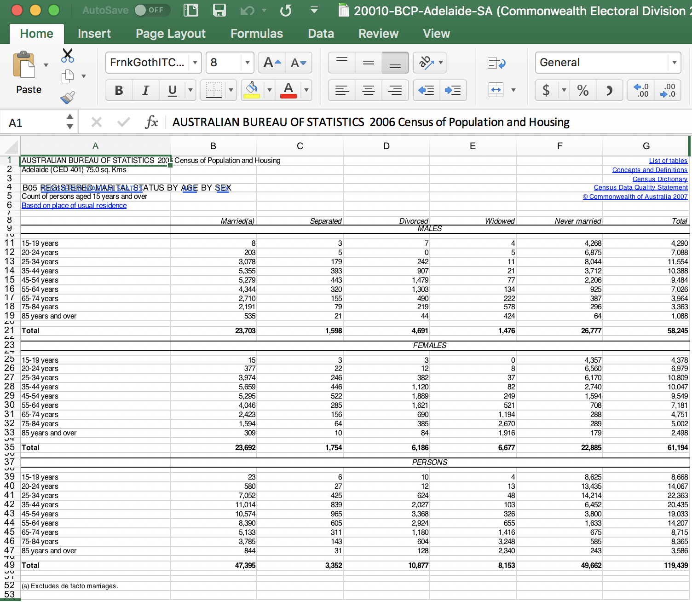

\appendix

# Raw ABS Census data snapshot

```{r excel-demo, fig.align="left", fig.cap="Screenshot of excel document containing responses to a question from the 2004 Census", out.width="80%"}

```

# Socio-demographic metrics for each electorate

Derived from ABS Census data, spanning years 2001--2016.

ID

: Commonwealth Electoral Divison (CED) number

Electorate

: Name of Commonwealth Electoral Division

State

: State of CED

Population

: Count of persons in CED

### Age {-}

Age00_04

: Percentage of population aged 0-4 years

Age05_14

: Percentage of population aged 5-14 years

Age15_19

: Percentage of population aged 15-19 years

Age20_24

: Percentage of population aged 20-24 years

Age25_34

: Percentage of population aged 25-34 years

Age35_44

: Percentage of population aged 35-44 years

Age45_54

: Percentage of population aged 45-54 years

Age55_64

: Percentage of population aged 55-64 years

Age65_74

: Percentage of population aged 65-74 years

Age75_84

: Percentage of population aged 75-84 years

Age85plus

: Percentage of population aged 85+ years

### Median Statistics  {-}

MedianPersonalIncome
: Median weekly personal income

MedianHouseholdIncome
: Median weekly household income

MedianFamilyIncome
: Median weekly family income

MedianAge
: Median age

MedianRent
: Median weekly rental payment amount (of those who rent)

MedianLoanPay
: Median mortgage loan repayment amount (of mortgage payments)

PersonalIncome_NS
: Rate of nonrespondence for questions relating to personal income, ie. percentage of people who did not answer the question (recorded as "not stated" or "inadequately stated")

FamilyIncome_NS
: Rate of nonrespondence for questions relating to family income, ie. percentage of people who did not answer the question (recorded as "not stated" or "inadequately stated")

HouseholdlIncome_NS
: Rate of nonrespondence for questions relating to household income, ie. percentage of people who did not answer the question (recorded as "not stated" or "inadequately stated")

### Religion {-}

Christianity
: Percentage of respondents that identified as Chrisitan

Catholic
: Percentage of respondents that identified as Catholic

Buddhism
: Percentage of respondents that identified as Buddist

Islam
: Percentage of respondents that identified as Muslim

Judaism
: Percentage of respondents that identified as Jewish

NoReligion
: Percentage of respondents that identified as "no religion", "athiest" etc.

Religion_NS
: Rate of nonrespondence for questions relating to household income, ie. percentage of people who did not answer the question (recorded as "not stated" or "inadequately stated")

### Language, Heritage, Birthplace and Citizenship {-}

Indigenous
: Percentage of population that identify as Indigenous or Torres Strait Islander

AusCitizen
: Percentage of population who are Australian Citizens

BornOverseas
: Percentage of respondents born overseas

BornOverseas_NS
: Rate of nonrespondence for questions relating to country of birth, ie. percentage of people who did not answer the question (recorded as "not stated" or "inadequately stated")

EnglishOnly
: Percentage of respondents that speak English only at home

EnglishOnly_NS
: Rate of nonrespondence for questions relating to language spoken at home, ie. percentage of people who did not answer the question (recorded as "not stated" or "inadequately stated")

OtherLanguageHome
: Percentage of respondents that speak other languages at home (note: this is 100% - EnglishOnly)

### Employment and Study {-}

Unemployed
: Unemployment rate (percentage)

LFParticipation
: Labour force participation rate (percentage)

CurrentlyStudying
: Percentage of population that are currently studying (Note that 'not stated' has not been taken into account as this is not available for 2016)

HighSchool
: Percentage of respondents (15 years and over) that have finished High School

HighSchool_NS
: Rate of nonrespondence for questions relating to High School completion

Bachelor
: Percentage of respondents (15 years and over) that have completed a Bachelors degree

Postgraduate
: Percentage of respondents (15 years and over) that have completed a Postgraduate degree

University_NS
: Rate of nonrespondence for questions relating to higher education

Volunteer
: Percentage of respondents (15 years and over) that do volunteer work [2006, 2011, 2016]

Volunteer_NS
: Rate of nonrespondence for questions relating to volunteer work [2006, 2011, 2016]

EmuneratedElsewhere
: Percentage of people who receive emuneration outside of Australia, out of the total population plus overseas visitors [2001 only]

### Family and Relationship {-}

Married
: Percentage of respondents that are married

DeFacto
: Percentage of respondents that are in a De Facto relationship

Relationship_NS
: Rate of nonrespondence for questions relating to relationship, ie. percentage of people who did not answer the question (recorded as "not stated" or "inadequately stated")

FamilyRatio
: Ratio of people in families to the number of total families (ie. average number of people per family)

### Dwelling {-}

NotOwned
: Percentage of dwellings (respondents only) that are owned outright or on a mortgage
Tenure_NS

: Rate of nonrespondence for questions relating to tenure, ie. percentage of people who did not answer the question (recorded as "not stated" or "inadequately stated")

InternetAccess
: Percentage of dwellings with internet access (of respondents) [2006, 2011, 2016]

InternetAccess_NS
: Rate of nonrespondence for questions relating to internet access at home [2006, 2011, 2016]

### Other {-}

InternetUse
: Percentage of people who used interent in the last week (of respondents) [2001 only]

InternetAccess_NS
: Rate of nonrespondence for questions relating to internet use [2001 only]

# Metric distributions across Census years

The figure below shows violin plots for four variables across Census years, providing a snapshot of the variables recorded for each year.

```{r vis-census1, fig.cap="Census derived metrics"}
ggplot(filter(vis_df, measure %in% c(levels(as.factor(vis_df$measure))[c(1:11,13:21)])),
       aes(x=year, y=value, fill=year)) + geom_violin() + facet_wrap(~measure, scales = "free_y") + theme(text=element_text(size=7), axis.text.x=element_text(size=6), axis.text.y=element_text(size=6)) + labs(x = "Year", y = "Metric (%)")
```

```{r vis-census2, fig.cap="Census derived metrics"}
ggplot(filter(vis_df, measure %in% c(levels(as.factor(vis_df$measure))[c(14:33)])),
       aes(x=year, y=value, fill=year)) + geom_violin() + facet_wrap(~measure, scales = "free_y") + theme(text=element_text(size=7), axis.text.x=element_text(size=6), axis.text.y=element_text(size=6)) + labs(x = "Year", y = "Metric (%)")
```

```{r vis-census3, fig.cap="Census derived metrics"}
ggplot(filter(vis_df, measure %in% c(levels(as.factor(vis_df$measure))[c(34:39,46:58)])),
       aes(x=year, y=value, fill=year)) + geom_violin() + facet_wrap(~measure, scales = "free_y") + theme(text=element_text(size=7), axis.text.x=element_text(size=6), axis.text.y=element_text(size=6)) + labs(x = "Year", y = "Metric (%)")
```

```{r vis-census4, fig.cap="Census derived metrics"}
ggplot(filter(vis_df, measure %in% c(levels(as.factor(vis_df$measure))[c(40:45)])),
       aes(x=year, y=value, fill=year)) + geom_violin() + facet_wrap(~measure, scales = "free_y") + theme(text=element_text(size=7), axis.text.x=element_text(size=6), axis.text.y=element_text(size=6)) + labs(x = "Year", y = "Metric (%)")
```

# Model diagnostics

## Non-linearities: Residuals against predictors
```{r, out.width="100%", fig.cap = "Residuals vs. predictors in the model. No signs of non-linearity."}
aug_all %>%
  filter(year == "2016") %>% 
  gather(key = "variable", value = "value", -c(starts_with("."), Perc_LNP, year)) %>% 
  ggplot(aes(x = value, y = .resid)) +
  geom_point() + geom_smooth() + facet_wrap(~variable, scales = "free_x")
```

No obvious non-linearities in 2001, 2004, 2007, 2010, 2013, 2016.

## Residuals vs Predictors not in model
```{r, out.width="100%", fig.cap = "Residuals vs. predictors in the model. No clear ."}
vars_not_in <- names(data_mod)[which(!names(data_mod) %in% superset$varname)]

aug_all %>% bind_cols(data_mod %>% filter(!is.na(Perc_LNP))) %>% 
  filter(year == "2013") %>% 
  select(starts_with("."), c(vars_not_in), -c(Swing, year, Election_Division)) %>% 
  gather(key = "variable", value = "value", -c(starts_with("."), Perc_LNP)) %>%
  ggplot(aes(x = value, y = .resid)) +
  geom_point() + geom_smooth(level = 0.95) + facet_wrap(~variable, scales = "free")
```

No obvious patterns in the residuals vs omitted variables.

# Summary of variables in each election

```{r summary2001, results = 'asis'}
stargazer::stargazer(data_mod %>% filter(year == "2001", !is.na(Perc_LNP)), title = "Summary statistics for each socio-demographic variable, and the response, for the 2001 election.", header = FALSE)
```
```{r summary2004, results = 'asis'}
stargazer::stargazer(data_mod %>% filter(year == "2004", !is.na(Perc_LNP)), title = "Summary statistics for each socio-demographic variable, and the response, for the 2004 election.", header = FALSE)
```
```{r summary2007, results = 'asis'}
stargazer::stargazer(data_mod %>% filter(year == "2007", !is.na(Perc_LNP)), title = "Summary statistics for each socio-demographic variable, and the response, for the 2007 election.", header = FALSE)
```
```{r summary2010, results = 'asis'}
stargazer::stargazer(data_mod %>% filter(year == "2010", !is.na(Perc_LNP)), title = "Summary statistics for each socio-demographic variable, and the response, for the 2010 election.", header = FALSE)
```
```{r summary2013, results = 'asis'}
stargazer::stargazer(data_mod %>% filter(year == "2013", !is.na(Perc_LNP)), title = "Summary statistics for each socio-demographic variable, and the response, for the 2013 election.", header = FALSE)
```
```{r summary2016, results = 'asis'}
stargazer::stargazer(data_mod %>% filter(year == "2016", !is.na(Perc_LNP)), title = "Summary statistics for each socio-demographic variable, and the response, for the 2016 election.", header = FALSE)
```

# Interpretation of more socio-demographics

This section contains the scatterplots and model visualizations that were omitted from the Insights section.

### Immigrants from the United Kingdom

Electorates with larger populations from the United Kingdom does not have a significant effect on two-party preference in any of the elections. From inspection of 

We expect greater populations from the UK to have a weakly positive relationship with support for the Liberal party (see figure \@ref(fig:rawUK)). The modelled effect is  Our model confirms this. BornUK is insignificant in every election. 

```{r rawUK, fig.cap="Scatterplot of population born in the United Kingdom against two-party preferred vote."}
## Voting against BornUK
data_mod %>% ggplot(aes(x = BornUK, y = Perc_LNP)) + geom_point(aes(label = Election_Division)) + geom_smooth(method = "lm") + facet_wrap(~year) + labs(x = "Population born in the United Kingdom", y = "Two-party preferred (%)")
```

```{r UK1, fig.cap="Estimated coefficients for population born in the United Kingdom across years with 95% confidence bands."}
# Coefficients
all_coefs %>% filter(term == "BornUK") %>% 
  ggplot(aes(x=year, y=estimate)) +
  geom_point(size = 3) + geom_linerange(aes(ymin = lower95, ymax = upper95), size = 1.5) + 
  geom_hline(aes(yintercept = 0), alpha = 0.5, size = 2) + 
  lims(y=c(-6.5,2.5)) +
  theme_bw() +
  theme(axis.text.x = element_text(size = 12), axis.text.y = element_text(size = 12), 
        axis.title = element_text(size = 12)) + 
  coord_fixed(0.15) + 
  labs(x = "", y = "Coefficient estimate: BornUK")
```

```{r UK2, out.width="100%"}
BornUK_01 <- visreg(fit_ss_01, "BornUK", gg = T, print.cond = FALSE) + 
  labs(x = "", y = "", title = "2001") +
  theme_bw() + 
  theme(plot.title = element_text(face = "bold", size = 10, hjust = 0.5)) +
  lims(x = c(-1.8, 5.2), y = c(32,68)) + coord_cartesian(expand = FALSE)
BornUK_04 <- visreg(fit_ss_04, "BornUK", gg = T, print.cond = FALSE) + 
  labs(x = "", y = "", title = "2004") +
  theme_bw() + 
  theme(plot.title = element_text(face = "bold", size = 10, hjust = 0.5)) +
  lims(x = c(-1.8, 5.2), y = c(32,68)) + coord_cartesian(expand = FALSE) 
BornUK_07 <- visreg(fit_ss_07, "BornUK", gg = T, print.cond = FALSE) + 
  labs(x = "", y = "", title = "2007") +
  theme_bw() + 
  theme(plot.title = element_text(face = "bold", size = 10, hjust = 0.5))  +
  lims(x = c(-1.8, 5.2), y = c(32,68)) + coord_cartesian(expand = FALSE)
BornUK_10 <- visreg(fit_ss_10, "BornUK", gg = T, print.cond = FALSE) + 
  labs(x = "", y = "", title = "2010") +
  theme_bw() + 
  theme(plot.title = element_text(face = "bold", size = 10, hjust = 0.5)) +
  lims(x = c(-1.8, 5.2), y = c(32,68)) + coord_cartesian(expand = FALSE) 
BornUK_13 <- visreg(fit_ss_13, "BornUK", gg = T, print.cond = FALSE) + 
  labs(x = "", y = "", title = "2013") +
  theme_bw() + 
  theme(plot.title = element_text(face = "bold", size = 10, hjust = 0.5)) +
  lims(x = c(-1.8, 5.2), y = c(32,68)) + coord_cartesian(expand = FALSE) 
BornUK_16 <- visreg(fit_ss_16, "BornUK", gg = T, print.cond = FALSE) + 
  labs(x = "", y = "", title = "2016") +
  theme_bw() + 
  theme(plot.title = element_text(face = "bold", size = 10, hjust = 0.5)) +
  lims(x = c(-1.8, 5.2), y = c(32,68)) + coord_cartesian(expand = FALSE) 

grid.arrange(BornUK_01, BornUK_04, BornUK_07, BornUK_10, BornUK_13, BornUK_16, 
             nrow = 2, 
             #top = textGrob("South-Eastern European Influence", gp = gpar(cex = 0.8)), 
             left = textGrob("Two-party preferred vote (%)", gp = gpar(cex = 0.8), rot = 90), 
             bottom = textGrob("Population born in the United Kingdom (relative)", gp = gpar(cex = 0.8)))
```

### Student population

```{r rawcurrstud, fig.cap="Scatterplot of population currently studying against two-party preferred vote."}
## Voting against CurrentlyStudying
data_mod %>% ggplot(aes(x = CurrentlyStudying, y = Perc_LNP)) + geom_point(aes(label = Election_Division)) + geom_smooth(method = "lm") + facet_wrap(~year) + labs(x = "Student population", y = "Two-party preferred (%)")
```

```{r currstud1, fig.cap="Estimated coefficients for student population across years with 95% confidence bands."}
# Coefficients
all_coefs %>% filter(term == "CurrentlyStudying") %>% 
  ggplot(aes(x=year, y=estimate)) +
  geom_point(size = 3) + geom_linerange(aes(ymin = lower95, ymax = upper95), size = 1.5) + 
  geom_hline(aes(yintercept = 0), alpha = 0.5, size = 2) + 
  lims(y=c(-8,8)) +
  theme_bw() +
  theme(axis.text.x = element_text(size = 12), axis.text.y = element_text(size = 12), 
        axis.title = element_text(size = 12)) + 
  coord_fixed(0.15) + 
  labs(x = "", y = "Coefficient estimate: CurrentlyStudying")
```

### Rental and Loan Payments

Rental prices and mortgage loan repayments do not appear to have a signficant relationship with party preference, based on the scatterplots. We find that in the 2010 election, higher median payment amounts had a highly positive relationship with support for the Liberal party. There is no obvious explanation for this, as housing affordability was not on the political agenda in the 2010 election.

```{r rawrentloan, fig.cap="Scatterplot of rental and loan payments against two-party preferred vote."}
## Voting against RentLoan
data_mod %>% ggplot(aes(x = RentLoan, y = Perc_LNP)) + geom_point(aes(label = Election_Division)) + geom_smooth(method = "lm") + facet_wrap(~year) + labs(x = "Rental and loan payments", y = "Two-party preferred (%)")
```

```{r rentloan1, fig.cap="Estimated coefficients for rental and loan payments across years with 95% confidence bands."}

# Coefficients
all_coefs %>% filter(term == "RentLoan") %>% 
  ggplot(aes(x=year, y=estimate)) +
  geom_point(size = 3) + geom_linerange(aes(ymin = lower95, ymax = upper95), size = 1.5) + 
  geom_hline(aes(yintercept = 0), alpha = 0.5, size = 2) + 
  lims(y=c(-8,8)) +
  theme_bw() +
  theme(axis.text.x = element_text(size = 12), axis.text.y = element_text(size = 12), 
        axis.title = element_text(size = 12)) + 
  coord_fixed(0.15) + 
  labs(x = "", y = "Coefficient estimate: RentLoan")
```

### Administrative Jobs and Education

Over all years we see that for moderate-to-high proportions of workers in administrative jobs, low education levels lead to support for the Liberal party. As we increase education, support increases for the Labor party. For at or below average proportions of administrative jobs, there is not as much of an education effect, as electorates for all education levels in this bracket would support Labor. 

```{r admineduc1, fig.cap="Modelled two-party preferred vote (fill) for combinations of education and administrative related jobs."}
admineduc_df <- data.frame(
  AdminJobs = rep(seq(-4,4, by = 0.01), times = 801),
  Education = rep(seq(-4,4, by = 0.01), each = 801),
  NoReligion = 0,
  CurrentlyStudying = 0,
  MedianAge = 0,
  OneParentHouse = 0,
  BornUK = 0,
  BornSEEurope = 0,
  ExtractiveJobs = 0,
  RentLoan = 0
)

admineduc_df$z16 = predict(fit_ss_16, admineduc_df) - fit_ss_16$coefficients[1]
admineduc_df$z13 = predict(fit_ss_13, admineduc_df) - fit_ss_13$coefficients[1]
admineduc_df$z10 = predict(fit_ss_10, admineduc_df) - fit_ss_10$coefficients[1]
admineduc_df$z07 = predict(fit_ss_07, admineduc_df) - fit_ss_07$coefficients[1]
admineduc_df$z04 = predict(fit_ss_04, admineduc_df) - fit_ss_04$coefficients[1]
admineduc_df$z01 = predict(fit_ss_01, admineduc_df) - fit_ss_01$coefficients[1]

Educ_Admin_16 <- admineduc_df %>% ggplot(aes(x=Education, y=AdminJobs)) +
  geom_raster(aes(fill = z16)) + 
  labs(x = "", y = "", fill = "Marginal effect on two-party preferred (%)", title = "2016") +
  theme_bw() + 
  theme(plot.title = element_text(face = "bold", size = 10, hjust = 0.5)) + geom_point(aes(x=Education,y=AdminJobs), data = data_mod %>% filter(year == "2016"), alpha = 0.5) +  
  scale_fill_gradientn(colours = c("#ff0000", "#ff6666", "#ff9999", "#ffcccc", "white", "#cce6ff", "#3399ff", "#3385ff", "#3366ff"), 
                       values = scales::rescale(c(min(admineduc_df$z16), -12, -6, -3, 
                                                  0, 3, 6, 12, max(admineduc_df$z16)))) +  
  guides(fill = FALSE) +
  lims(x = c(-1,3.6), y = c(-3.9, 3.0)) + coord_fixed(expand=FALSE, ratio = 4.6/6.9)

Educ_Admin_13 <- admineduc_df %>% ggplot(aes(x=Education, y=AdminJobs)) +
  geom_raster(aes(fill = z13)) + 
  labs(x = "", y = "", fill = "Marginal effect on two-party preferred (%)", title = "2013") +
  theme_bw() + 
  theme(plot.title = element_text(face = "bold", size = 10, hjust = 0.5)) + geom_point(aes(x=Education,y=AdminJobs), data = data_mod %>% filter(year == "2013"), alpha = 0.5) +  
  scale_fill_gradientn(colours = c("#ff0000", "#ff6666", "#ff9999", "#ffcccc", "white", "#cce6ff", "#3399ff", "#3385ff", "#3366ff"), 
                       values = scales::rescale(c(min(admineduc_df$z13), -12, -6, -3, 
                                                  0, 3, 6, 12, max(admineduc_df$z13)))) +  
  guides(fill = FALSE) +
  lims(x = c(-1,3.6), y = c(-3.9, 3.0)) + coord_fixed(expand=FALSE, ratio = 4.6/6.9)

Educ_Admin_10 <- admineduc_df %>% ggplot(aes(x=Education, y=AdminJobs)) +
  geom_raster(aes(fill = z10)) + 
  labs(x = "", y = "", fill = "Marginal effect on two-party preferred (%)", title = "2010") +
  theme_bw() + 
  theme(plot.title = element_text(face = "bold", size = 10, hjust = 0.5)) + geom_point(aes(x=Education,y=AdminJobs), data = data_mod %>% filter(year == "2010"), alpha = 0.5) +  
  scale_fill_gradientn(colours = c("#ff0000", "#ff6666", "#ff9999", "#ffcccc", "white", "#cce6ff", "#3399ff", "#3385ff", "#3366ff"), 
                       values = scales::rescale(c(min(admineduc_df$z10), -12, -6, -3, 
                                                  0, 3, 6, 12, max(admineduc_df$z10)))) +  
  guides(fill = FALSE) +
  lims(x = c(-1,3.6), y = c(-3.9, 3.0)) + coord_fixed(expand=FALSE, ratio = 4.6/6.9)

Educ_Admin_07 <- admineduc_df %>% ggplot(aes(x=Education, y=AdminJobs)) +
  geom_raster(aes(fill = z07)) + 
  labs(x = "", y = "", fill = "Marginal effect on two-party preferred (%)", title = "2007") +
  theme_bw() + 
  theme(plot.title = element_text(face = "bold", size = 10, hjust = 0.5)) + geom_point(aes(x=Education,y=AdminJobs), data = data_mod %>% filter(year == "2007"), alpha = 0.5) +  
  scale_fill_gradientn(colours = c("#ff0000", "#ff6666", "#ff9999", "#ffcccc", "white", "#cce6ff", "#3399ff", "#3385ff", "#3366ff"), 
                       values = scales::rescale(c(min(admineduc_df$z07), -12, -6, -3, 
                                                  0, 3, 6, 12, max(admineduc_df$z07)))) +  
  guides(fill = FALSE) +
  lims(x = c(-1,3.6), y = c(-3.9, 3.0)) + coord_fixed(expand=FALSE, ratio = 4.6/6.9)

Educ_Admin_04 <- admineduc_df %>% ggplot(aes(x=Education, y=AdminJobs)) +
  geom_raster(aes(fill = z04)) + 
  labs(x = "", y = "", fill = "Marginal effect on two-party preferred (%)", title = "2004") +
  theme_bw() + 
  theme(plot.title = element_text(face = "bold", size = 10, hjust = 0.5)) + geom_point(aes(x=Education,y=AdminJobs), data = data_mod %>% filter(year == "2004"), alpha = 0.5) +  
  scale_fill_gradientn(colours = c("#ff0000", "#ff6666", "#ff9999", "#ffcccc", "white", "#cce6ff", "#3399ff", "#3385ff", "#3366ff"), 
                       values = scales::rescale(c(min(admineduc_df$z04), -12, -6, -3, 
                                                  0, 3, 6, 12, max(admineduc_df$z04)))) +  
  guides(fill = FALSE) +
  lims(x = c(-1,3.6), y = c(-3.9, 3.0)) + coord_fixed(expand=FALSE, ratio = 4.6/6.9)

Educ_Admin_01 <- admineduc_df %>% ggplot(aes(x=Education, y=AdminJobs)) +
  geom_raster(aes(fill = z01)) + 
  labs(x = "", y = "", fill = "Marginal effect on two-party preferred (%)", title = "2001") +
  theme_bw() + 
  theme(plot.title = element_text(face = "bold", size = 10, hjust = 0.5)) + geom_point(aes(x=Education,y=AdminJobs), data = data_mod %>% filter(year == "2001"), alpha = 0.5) +  
  scale_fill_gradientn(colours = c("#ff0000", "#ff6666", "#ff9999", "#ffcccc", "white", "#cce6ff", "#3399ff", "#3385ff", "#3366ff"), 
                       values = scales::rescale(c(min(admineduc_df$z01), -12, -6, -3, 
                                                  0, 3, 6, 12, max(admineduc_df$z01)))) +  
  guides(fill = FALSE) +
  lims(x = c(-1,3.6), y = c(-3.9, 3.0)) + coord_fixed(expand=FALSE, ratio = 4.6/6.9)

grid.arrange(Educ_Admin_01, Educ_Admin_04, Educ_Admin_07, Educ_Admin_10, Educ_Admin_13, Educ_Admin_16, 
             nrow = 2, 
             bottom = textGrob("Education level", gp = gpar(cex = 0.8)), 
             left = textGrob("Administrative jobs", gp = gpar(cex = 0.8), rot = 90))

```

```{r admineduc_scale, out.width="50%"}
## TPP scale
TPP_scale <- readPNG("figures/TPP_scale.png")
 grid.raster(TPP_scale)
```

# Why choose all five variable linear models?

For each election, we compute all possible five variable linear models as a model set from which Akaike weights will be computed. *Five* variables models are a compromise between computational burden and capturing sufficient information in the model set. 

Because we can't run linear models for all possible combinations of our predictors, we use an iterative procedure to fit 20 models for each number of predictors. This means 20 models with 2 variables, 20 models with 3 variables and so on. The process is as follows:

1. Fit all possible 2 variable models.

2. Retain the 10 models with highest R-squared, and another 10 models selected at random.

3. Fit all possible three variable models to each of these 20 two-variable models, by adding one variable. This means for every retained model, there will be $30 - 2 = 28$ models fit.

4. Repeat steps 2 and 3 for the 3 variable models, 4 variable models, and so on, until reaching a model with all 30 variables.

Figure \@ref(fig:tradeoff2) shows the R-squared for each of the models retained, with the number of predictors on the x-axis, and R-squared on the y-axis. The line represents the maximum R-squared each number of predictors. We see that around 70% of variation in two-party preference can be explained by a five variable model in each election, and the full variable set explains around 80% of variation (i.e. R-squared of 0.8%). We see that from variable 4 onwards, there is little incremental gain in R-squared from adding another variable.

All possible $p$ variable models for each election involves fitting ${30 \choose p} \times 6$ models. The computational burden here becomes huge very quickly. For this reason, we have chosen $p=5$ variable models, as it is computationally feasible and we still will capture models that have high R-squared.

```{r tradeoff2, fig.cap = "Estimates of R-squared against number of variables included in a linear model."}
ggplot(aes(x = num_vars, y = r2), data = step_all) + 
  geom_point(alpha = 0.3) +
  geom_line(data = step_all %>% filter(max_r2 == 1)) +
  facet_wrap(~year) +
  labs(x = "Number of variables", y = "R-squared")
```

## Resultant Akaike weights

```{r allSAW, fig.cap = "Sum of Akaike weights for each variable, in each election.", results = 'asis'}
load("../Modelling-Elections/Clean-Data/var_imp_all.rda")

tab_aw <- var_imp_all %>% 
  select(varname, year, sum_w) %>% 
  spread("year", "sum_w") %>% 
  rename(Variable = varname) %>% 
  xtable::xtable(caption = "Sum of Akaike weights for each variable, in each election.")

print(tab_aw, comment = FALSE, include.rownames = FALSE)
```

# Omitted variables

We linearly regress each omitted variable against the superset of predictors, and record the R-squared values in each election.

```{r ovb, fig.cap = "R-squared of each omitted variable when regressed on the superset each year."}
OVB_fn <- function(Year) {
  Year <- as.character(Year)
  
OVB_lm <- data.frame(varname = names(data_mod), r2 = 0, adj_r2 = 0) %>% 
  filter(!varname %in% c("Election_Division", "Perc_LNP", "Swing", "year", superset$varname %>% unlist %>% as.character))

for (i in 1:nrow(OVB_lm)) {
  varname = OVB_lm$varname[i] %>% as.character()
  data_ovb = data_mod %>% filter(year == Year, !is.na(Perc_LNP)) %>% select(c(superset$varname %>% as.character), varname)
  formula_ovb = paste0(varname, " ~ .")
  lmod = lm(formula = formula_ovb,
            data = data_ovb)
  OVB_lm$r2[i] = summary(lmod)$r.squared
  OVB_lm$adj_r2[i] = summary(lmod)$adj.r.squared
}

OVB_lm <- OVB_lm %>% mutate(year = Year)

return(OVB_lm)
}

OVB_all <- bind_rows(OVB_fn(2001), OVB_fn(2004), OVB_fn(2007), OVB_fn(2010), OVB_fn(2013), OVB_fn(2016)) %>% 
  select(-adj_r2)

OVB_all %>% ggplot(aes(x=r2, y = varname)) + 
  geom_point(aes(col = year), size = 2) +
  labs(x = "R-squared", y = "Omitted Variable") 

# Order by average in each row
# Discuss those above 75%
# Others:

# Argue - avoided OVB by construction
# Then discuss why some variables are omitted
```


